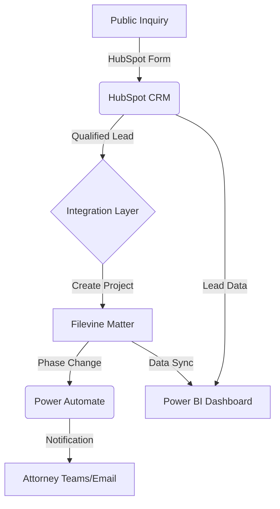

# System Architecture & Workflow Map

## Technical Ecosystem
This project demonstrates a unified legal operations environment connecting intake, matter management, and business intelligence.

### 1. Intake & Lead Management (HubSpot)
*   **Role:** Capture prospective client inquiries.
*   **Automation:** When a lead is marked "Qualified", a trigger pushes contact and matter data to Filevine.

### 2. Matter Management (Filevine)
*   **Role:** The "Source of Truth" for case data, deadlines, and documents.
*   **Workflow:** Phase-based progression (Intake -> Discovery -> Negotiation -> Settlement).

### 3. Automation Layer (Power Automate / Filevine API)
*   **Notification:** Alerts attorneys via Teams/Email on phase changes.
*   **Document Generation:** Pulls matter data to populate legal templates.

### 4. Reporting & Analytics (Power BI)
*   **Data Sources:** Filevine (Case performance), HubSpot (Lead conversion rates).
*   **Metrics:** Settlement forecasting, attorney caseload, cycle time per phase.

### 5. Version Control (GitHub)
*   **Role:** Hosting technical documentation, SQL scripts, and Power BI configuration.

---

## Visual Workflow

